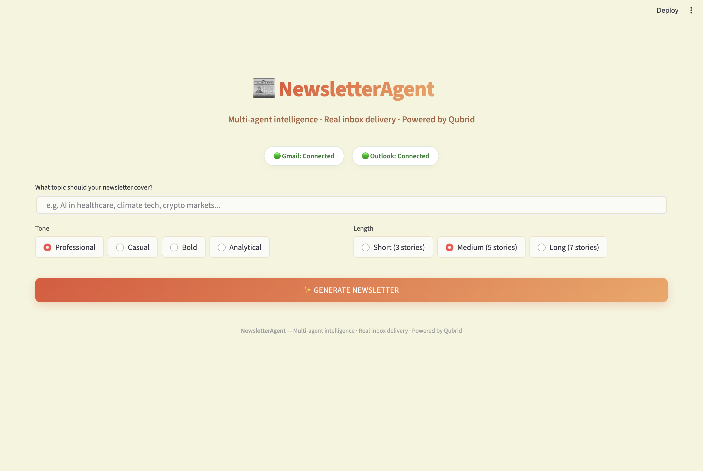
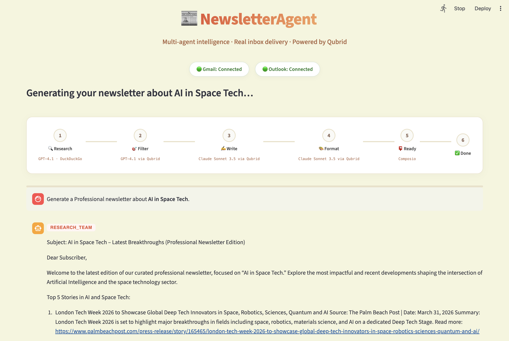
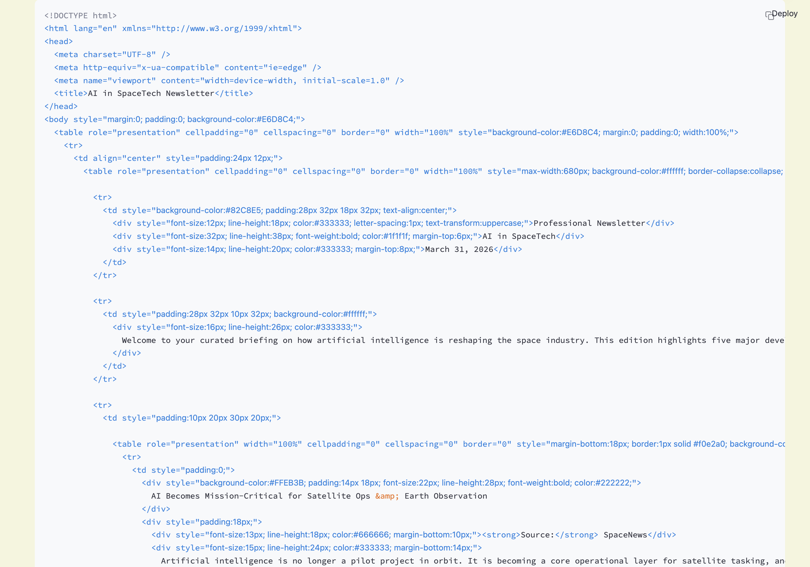
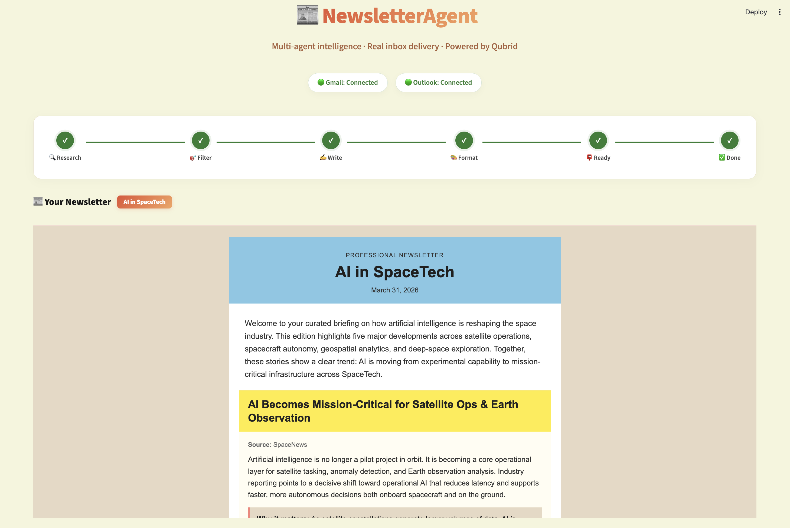
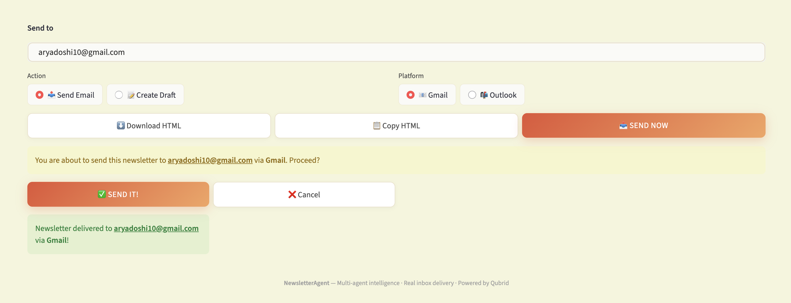
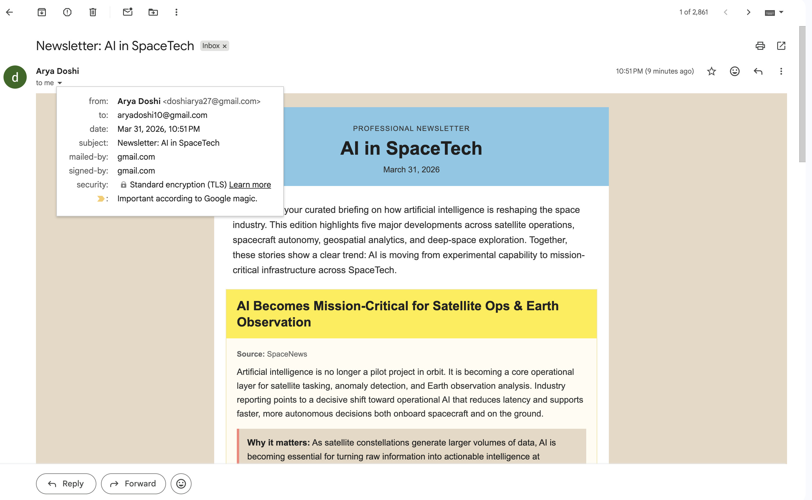
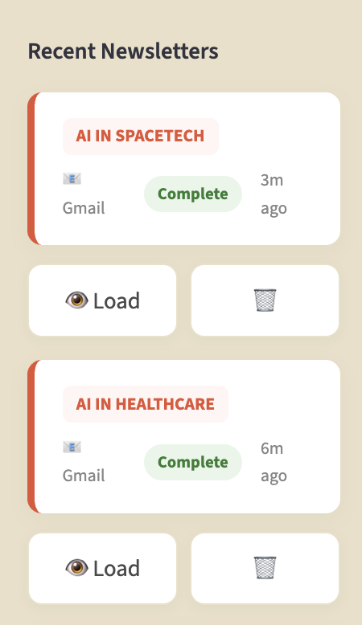

<div align="center">


# 📰 NewsletterAgent

### Research. Write. Deliver.
**An end-to-end agentic newsletter pipeline — from raw topic to formatted email in your inbox.**

<br>

[](https://python.org)
[](https://google.github.io/adk-docs/)
[](https://composio.dev)
[](https://streamlit.io)
[](https://qubrid.com)
[](LICENSE)

> A **5-agent AI pipeline** powered by **[Qubrid AI](https://qubrid.com)** that researches the web, filters signal from noise, writes, formats, and delivers a professional newsletter — straight to your Gmail or Outlook inbox.

</div>

---

## What It Does

NewsletterAgent takes a single topic and runs it through a fully automated multi-agent pipeline that:

- **Researches** — searches the web for the latest, most relevant articles using Tavily
- **Filters** — scores every article for relevance, recency, and impact — drops the noise
- **Writes** — drafts a full newsletter with punchy headlines, summaries, and a closing note
- **Formats** — wraps the content in a production-ready, responsive HTML email template
- **Delivers** — sends to Gmail or Outlook (or saves as draft) via secure Composio OAuth

All models served through **[Qubrid AI](https://qubrid.com)** — GPT-4.1 and Claude Sonnet 3.5.

---

## ✨ Features

### Core Capabilities
- 📡 **Live Agent Streaming** — watch each agent think and write in real-time (Gemini-style typewriter)
- 🎨 **Responsive HTML Email** — inline-styled, mobile-friendly newsletter rendered in the browser
- 📧 **Gmail + Outlook** — send directly or save as draft to either connected account
- 📝 **Action Control** — choose Send Email or Create Draft, then choose your platform
- 📚 **Session History** — all newsletters saved to SQLite; reload any past session in one click
- 🧩 **Visual Step Tracker** — animated stepper shows which agent is running at each stage
- ⬇️ **One-Click Download** — export the finished newsletter as an `.html` file

### Agentic Intelligence
- 🔍 **Research Team** — Tavily web search, fetches top articles on any topic
- 🗂️ **Content Filter** — LLM scores each article and selects only the highest-value items
- ✍️ **Newsletter Writer** — drafts the full newsletter with tone and length control
- 🎨 **HTML Formatter** — wraps the draft into a polished, inline-styled email template
- 📬 **Delivery Agent** — routes the email via Composio to your chosen account

---

## 📸 Screenshots

### 🏠 Home — Topic Input & Configuration
<!-- Add screenshot -->


---

### ⚙️ Live Agent Pipeline — Real-Time Progress
<!-- Add screenshot -->


---

### 📰 Newsletter Preview — Rendered HTML
<!-- Add screenshot -->


---

### 📱 Newsletter Content — Detailed View
<!-- Add screenshot -->


---

### 📬 Delivery Panel — Send or Draft
<!-- Add screenshot -->


---

### ✅ Inbox Delivery — Real-World Result
<!-- Add screenshot -->


---

### 📚 Session History Sidebar
<!-- Add screenshot -->


---

## 🏗️ How the Pipeline Works

```
Topic + Tone + Length
        ↓
[1] 🔍 Research Team
    └─ Tavily searches the web for the top N articles on the topic
        ↓
[2] 🗂️ Content Filter
    └─ LLM scores each article: Relevance · Recency · Impact
    └─ Drops low-signal items, keeps only the best
        ↓
[3] ✍️ Newsletter Writer
    └─ Drafts the newsletter with headline, intros, summaries, CTA
    └─ Tone and length applied from user settings
        ↓
[4] 🎨 HTML Formatter
    └─ Wraps draft into responsive, inline-styled HTML email
        ↓
[5] 📬 Delivery Agent
    └─ Sends via Composio → Gmail or Outlook
    └─ Or saves as draft to the chosen account
```

---

## 🤖 Agent Reference

| # | Agent | Model | Role |
|---|-------|-------|------|
| 1 | 🔍 Research Team | Tavily Search API | Fetches latest articles from the web on the given topic |
| 2 | 🗂️ Content Filter | GPT-4.1 via Qubrid AI | Scores and filters articles by relevance, recency, and impact |
| 3 | ✍️ Newsletter Writer | Claude Sonnet 3.5 via Qubrid AI | Drafts the full newsletter — headlines, summaries, closing |
| 4 | 🎨 HTML Formatter | Claude Sonnet 3.5 via Qubrid AI | Converts draft to responsive HTML email template |
| 5 | 📬 Delivery Agent | Composio (Gmail / Outlook) | Sends or drafts the email to your connected account |

---

## 🔧 Built with Google ADK

NewsletterAgent is built on top of **[Google Agent Development Kit (ADK)](https://google.github.io/adk-docs/)** — Google's open framework for building, testing, and orchestrating multi-agent AI pipelines.

### How ADK Powers This Project

```python
from google.adk.agents import LlmAgent
from google.adk.models.lite_llm import LiteLlm
```

Every agent in the pipeline is a `LlmAgent` defined with ADK:

```python
filter_agent = LlmAgent(
    name="ContentFilter",
    model=LiteLlm(model="openai/gpt-4.1", api_base=QUBRID_BASE_URL),
    instruction=FILTER_PROMPT,
    tools=[],
)
```

**ADK's role in the pipeline:**
- **Agent Definitions** — each of the 5 pipeline stages is an `LlmAgent` with its own system prompt, model, and tools
- **LiteLLM Bridge** — ADK's `LiteLlm` integration connects seamlessly to **Qubrid AI's** OpenAI-compatible endpoint, enabling GPT-4.1 and Claude Sonnet 3.5 without changing provider code
- **Session Management** — ADK's `InMemorySessionService` and `Runner` coordinate state between agents
- **Async Streaming** — ADK's async event loop powers the live token-by-token streaming in the UI

---

## 📬 Email Delivery with Composio

NewsletterAgent uses **[Composio](https://composio.dev)** for OAuth-based email delivery — your Gmail and Outlook accounts are connected securely, no passwords stored.

### How Composio Powers Delivery

```python
from composio import ComposioToolSet, Action

toolset = ComposioToolSet(api_key=COMPOSIO_API_KEY, entity_id=COMPOSIO_ENTITY_ID)

# Gmail — send HTML email
toolset.actions.execute(
    action=Action.GMAIL_SEND_EMAIL,
    params={"recipient_email": to, "subject": subject, "body": html, "is_html": True},
    connected_account=gmail_account_id,
)

# Outlook — send HTML email
toolset.actions.execute(
    action=Action.OUTLOOK_OUTLOOK_SEND_EMAIL,
    params={"to_email": to, "subject": subject, "body": html, "body_type": "html"},
    connected_account=outlook_account_id,
)
```

**Composio's role:**
- **OAuth Connection** — CLI-based setup (`composio add gmail`) links your account in 60 seconds
- **Gmail Actions** — `GMAIL_SEND_EMAIL` · `GMAIL_CREATE_EMAIL_DRAFT`
- **Outlook Actions** — `OUTLOOK_OUTLOOK_SEND_EMAIL` · `OUTLOOK_OUTLOOK_CREATE_DRAFT`
- **Account Routing** — each action uses the active `connected_account_id` fetched at runtime, making multi-account support seamless
- **No credentials stored** — all auth flows through Composio's managed OAuth layer

---

## What Makes This Different

| Feature | NewsletterAgent | Manual Newsletter |
|---------|----------------|------------------|
| Research | ✅ Auto web search via Tavily | ❌ You find every article |
| Filtering | ✅ LLM scores & ranks articles | ❌ Manual curation |
| Writing | ✅ Agent writes the full draft | ❌ You write from scratch |
| Formatting | ✅ Responsive HTML auto-generated | ❌ Manual email builder |
| Delivery | ✅ One-click Gmail + Outlook | ❌ Copy-paste into email client |
| Memory | ✅ SQLite history — every newsletter saved | ❌ Nothing persisted |
| Live feedback | ✅ Streaming agents visible in real time | ❌ Black box |

---

## 🛠️ Tech Stack

| Layer | Technology |
|-------|-----------|
| Agent Framework | **Google ADK** (LlmAgent, Runner, InMemorySessionService) |
| Model Hosting | **[Qubrid AI](https://qubrid.com)** — GPT-4.1 & Claude Sonnet 3.5 |
| LLM Bridge | **LiteLLM** via `google.adk.models.lite_llm.LiteLlm` |
| Email Delivery | **Composio** — Gmail & Outlook OAuth actions |
| Web Research | **Tavily Search API** |
| UI | **Streamlit** — Burnt Sienna custom theme |
| Backend API | **FastAPI** — async pipeline runner |
| Database | **SQLite** — session history |

---

## 🚀 Quick Start

### Prerequisites

- Python 3.11+
- A **[Qubrid AI](https://platform.qubrid.com)** API key
- A **Composio** API key
- A **Tavily** API key

### 1. Clone & Install

```bash
git clone https://github.com/aryadoshii/newsletter-agent.git
cd newsletter-agent

python -m venv .venv
source .venv/bin/activate   # Windows: .venv\Scripts\activate

pip install -r requirements.txt
```

### 2. Configure Environment

```bash
cp .env.example .env
```

Edit `.env`:

```env
# Qubrid AI — model hosting
QUBRID_API_KEY=your_qubrid_api_key
QUBRID_BASE_URL=https://api.qubrid.com/v1

# Composio — email delivery
COMPOSIO_API_KEY=your_composio_api_key
COMPOSIO_ENTITY_ID=default

# Tavily — web research
TAVILY_API_KEY=your_tavily_api_key
```

Get your keys:
| Service | Where to get it |
|---------|----------------|
| Qubrid AI | [app.qubrid.com](https://app.qubrid.com) → API Keys |
| Composio | [app.composio.dev](https://app.composio.dev) → Settings → API Keys |
| Tavily | [app.tavily.com](https://app.tavily.com) → API Keys |

### 3. Connect Email Accounts (Composio)

```bash
pip install composio-core
composio login        # paste your Composio API key

composio add gmail    # opens browser → sign in with Google → grant permissions
composio add outlook  # opens browser → sign in with Microsoft → grant permissions

composio connections  # verify both show as ACTIVE
```

### 4. Run

Two terminals:

```bash
# Terminal 1 — FastAPI backend
uvicorn main:app --reload --port 8000

# Terminal 2 — Streamlit frontend
streamlit run app.py
```

Open **http://localhost:8501** 🎉

---

## 🎮 Usage

1. **Enter a topic** — e.g. `AI in healthcare`, `crypto markets this week`, `climate tech`
2. **Pick tone & length** — Professional / Casual / Bold / Analytical × Short / Medium / Long
3. **Click ✨ Generate Newsletter** — 5 agents run live with streaming output
4. **Preview** the rendered HTML newsletter
5. **Deliver** — choose Send or Draft → Gmail or Outlook → enter recipient → confirm

---

## 📁 Project Structure

```
newsletter-agent/
├── agents/              # Google ADK LlmAgent definitions (5 pipeline stages)
│   ├── research.py      # Research Team — Tavily search
│   ├── filter.py        # Content Filter — LLM scoring
│   ├── writer.py        # Newsletter Writer — full draft
│   ├── formatter.py     # HTML Formatter — responsive template
│   ├── delivery.py      # Delivery Agent — Composio routing
│   └── orchestrator.py  # ADK Runner that sequences all agents
├── api/                 # FastAPI routes (pipeline, send, health)
├── config/              # App settings and model constants
├── database/            # SQLite session store
├── frontend/            # Streamlit UI (components.py, styles.py)
├── tools/               # Composio email tools + Tavily search tools
├── outputs/             # Generated HTML newsletters (gitignored)
├── app.py               # Streamlit entry point
├── main.py              # FastAPI entry point
└── requirements.txt
```

---

## 🛠️ Troubleshooting

**Email lands in Spam?**
Normal for first OAuth send. Open the email → click "Not Spam". Future emails go to inbox.

**Composio shows "Not connected"?**
Re-run `composio add gmail` or `composio add outlook` — the OAuth token may have expired.

**Model errors (429 / rate limits)?**
Verify your `QUBRID_API_KEY` has sufficient credits at [app.qubrid.com](https://app.qubrid.com).

**Port 8000 already in use?**
Run `uvicorn main:app --reload --port 8001` and update `API_BASE_URL` in `config/settings.py`.

---

<div align="center">

Made with ❤️ by **[Qubrid AI](https://qubrid.com)**

</div>
